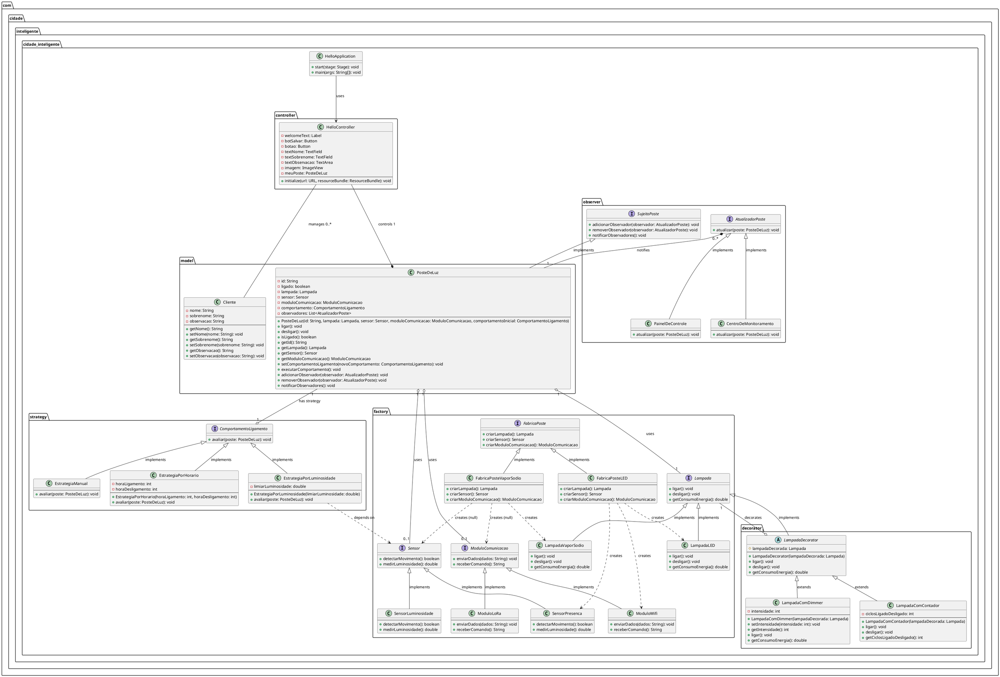

# Projeto Cidade Inteligente: Sistema de Iluminação Pública Inteligente

## Visão Geral

Este projeto é uma simulação de um sistema de iluminação pública inteligente, desenvolvido como parte da disciplina de Programação Orientada a Objetos. O foco principal é a sustentabilidade, otimizando o consumo de energia por meio de diferentes estratégias de funcionamento dos postes de luz. A aplicação demonstra a aplicação de conceitos fundamentais de Orientação a Objetos e Padrões de Projeto GoF em um cenário prático.

Este projeto utiliza Maven para gerenciamento de dependências e JavaFX para a interface gráfica.

## Pré-requisitos

 * **JDK 17 ou superior**
 * **Maven**

## Funcionalidades Implementadas

* **Simulação de Postes de Luz:** Gerenciamento do estado (ligado/desligado) e comportamento de múltiplos postes de luz.
* **Diferentes Tipos de Postes:** Capacidade de criar postes com diferentes tecnologias (ex: LED, Vapor de Sódio) e componentes (sensores, módulos de comunicação).
* **Estratégias de Iluminação:** Postes que podem operar de forma manual, por horário ou por luminosidade ambiente.
* **Funcionalidades Adicionais da Lâmpada:** Lâmpadas que podem ter funcionalidades como controle de intensidade (dimmer) e contagem de ciclos de uso.
* **Monitoramento:** Um painel de controle simples que reage às mudanças de estado dos postes em tempo real.
* **Interface Gráfica (JavaFX):** Uma interface intuitiva para visualizar e interagir com a simulação dos postes.

## Conceitos de POO Aplicados

Este projeto foi construído com base nos pilhos da Programação Orientada a Objetos:

* **Classes e Objetos:** Representação de entidades do domínio como `PosteDeLuz`, `Lampada`, `Sensor`, `ModuloComunicacao`, `Cliente`, entre outros.
* **Encapsulamento:** Utilização de atributos privados e métodos públicos (getters/setters) para controlar o acesso aos dados e garantir a integridade dos objetos (ex: na classe `PosteDeLuz`).
* **Herança:** Demonstração em padrões como o Decorator (`LampadaComDimmer` e `LampadaComContador` estendendo `LampadaDecorator`) e na implementação de interfaces.
* **Polimorfismo:** Capacidade de objetos de diferentes classes (que implementam a mesma interface) serem tratados de forma uniforme (ex: uma variável do tipo `Lampada` pode referenciar `LampadaLED` ou `LampadaVaporSodio`, e o método `ligar()` se comporta de maneira específica para cada um).
* **Associações:**
    * **Agregação:** Um `PosteDeLuz` "possui" uma `Lampada`, um `Sensor` e um `ModuloComunicacao`. Esses componentes podem existir independentemente do poste.
    * **Dependência:** (O `HelloController` e o  `BairroController`) "usa" as classes do modelo (`PosteDeLuz`) e as interfaces dos padrões para orquestrar a lógica da aplicação e interagir com a UI.

## Padrões de Projeto GoF Utilizados

Foram aplicados quatro padrões de projeto do GoF para garantir a flexibilidade, manutenibilidade e extensibilidade do sistema:

1.  **Abstract Factory (Padrão de Criação)**
    * **Por que foi escolhido:** Permite a criação de famílias de objetos relacionados (`Lampada`, `Sensor`, `ModuloComunicacao`) sem especificar suas classes concretas. Isso é crucial para que possamos trocar facilmente entre diferentes "tecnologias" de poste (ex: postes LED vs. postes de Vapor de Sódio) sem alterar o código cliente que utiliza a fábrica.
    * **Classes Chave:** `FabricaPoste` (interface), `FabricaPosteLED`, `FabricaPosteVaporSodio` (fábricas concretas), `Lampada`, `Sensor`, `ModuloComunicacao` (interfaces de produto), e suas implementações concretas (ex: `LampadaLED`, `SensorPresenca`, `ModuloWifi`).

2.  **Observer (Padrão Comportamental)**
    * **Por que foi escolhido:** Essencial para implementar um sistema de monitoramento onde múltiplos componentes precisam reagir a mudanças no estado de um objeto (`PosteDeLuz`) sem que o objeto (`PosteDeLuz`) precise saber quem são seus "observadores". Facilita a criação de painéis de controle, logs e outros sistemas de notificação.
    * **Classes Chave:** `SujeitoPoste` (interface do assunto observável), `PosteDeLuz` (assunto concreto), `AtualizadorPoste` (interface do observador), `PainelDeControle`, `CentroDeMonitoramento` (observadores concretos).

3.  **Strategy (Padrão Comportamental)**
    * **Por que foi escolhido:** Permite definir uma família de algoritmos (estratégias de ligamento/desligamento do poste), encapsular cada um deles e torná-los intercambiáveis. Isso significa que o comportamento de ligar/desligar um poste pode ser alterado dinamicamente em tempo de execução, sem modificar a classe `PosteDeLuz`.
    * **Classes Chave:** `ComportamentoLigamento` (interface da estratégia), `EstrategiaManual`, `EstrategiaPorHorario`, `EstrategiaPorLuminosidade` (estratégias concretas). A classe `PosteDeLuz` atua como o "contexto" que utiliza a estratégia.

4.  **Decorator (Padrão Estrutural)**
    * **Por que foi escolhido:** Oferece uma alternativa flexível à herança para estender a funcionalidade de um objeto dinamicamente. No contexto das lâmpadas, permite adicionar recursos como dimmer ou contador de ciclos a uma `Lampada` existente sem modificar sua classe original, promovendo o princípio Open/Closed.
    * **Classes Chave:** `Lampada` (componente), `LampadaDecorator` (decorator abstrato), `LampadaComDimmer`, `LampadaComContador` (decorators concretos).

## Estrutura do Projeto (Pacotes)

O projeto está organizado em pacotes para promover a modularidade e a separação de responsabilidades.

## Diagrama de Classes UML

Um diagrama de classes UML detalhado pode ser gerado a partir do código PlantUML fornecido na documentação do projeto. Este diagrama ilustra as classes, interfaces, atributos, métodos e as relações (herança, implementação, associações, dependência) entre os componentes, incluindo a aplicação dos padrões de projeto.

## Tratamento de Exceções
O sistema incorpora tratamento de exceções em pontos críticos, como:

* **Carregamento de Recursos**: IOException ao carregar arquivos FXML ou imagens (HelloApplication, BairroController).

* **Validação de Entrada**: (A ser implementado conforme a complexidade da UI cresce) Captura de entradas inválidas do usuário em formulários.

* **Operações de Arquivo**: (Se implementado) IOException durante leitura ou gravação de configurações ou logs em arquivos.

* **NullPointerExceptions**: Inicialização cuidadosa de objetos (como botoesControleManual no BairroController) para evitar referências nulas.

## Como Executar o Projeto

* Clone o repositório:

git clone <URL_DO_SEU_REPOSITORIO>
cd cidade_inteligente

* Compile o projeto com Maven:

mvn clean javafx:run  ou  mvn clean install

